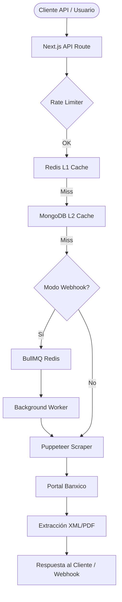

# Reporte Técnico: Banxico CEP Scraper & API (Enterprise Edition)

## 1. Introducción
Este documento detalla la arquitectura técnica, el stack de desarrollo y las estrategias de optimización del **Banxico CEP Scraper**. El sistema está diseñado para automatizar la consulta, validación y extracción de datos de los Comprobantes Electrónicos de Pago (CEP) emitidos por el Banco de México, transformando una infraestructura legacy en un servicio de grado empresarial con capacidades SaaS.

---

## 2. Stack Tecnológico

| Capa | Tecnología | Descripción |
| :--- | :--- | :--- |
| **Framework** | Next.js 15+ (App Router) | Base para la API y el Dashboard administrativo. |
| **Automatización** | Puppeteer Stealth | Motores de navegación con plugins de evasión de detección bot. |
| **Base de Datos** | MongoDB (Mongoose) | Persistencia de datos técnica y caché de nivel 2 (L2). |
| **Caché L1** | Redis (Upstash) | Almacenamiento volátil para respuestas ultra-rápidas. |
| **Gestión de Colas** | BullMQ & IORedis | Procesamiento asíncrono para tareas de larga duración. |
| **UI/UX** | Framer Motion & Lenis | Animaciones premium y scroll inercial. |

---

## 3. Arquitectura del Sistema

El sistema utiliza una arquitectura distribuida para manejar la latencia inherente del portal de Banxico (60-90 segundos por consulta).

---

## 4. Lógica de Automatización (Core)

### 4.1. Bypassing y Sigilo
Para evitar bloqueos por parte de los firewalls de Banxico, el sistema implementa:
- **Puppeteer Extra Stealth**: Modifica los prototipos de `navigator.webdriver` y otras huellas digitales del navegador.
- **Intercepción de Peticiones**: Se bloquean scripts de rastreo y recursos innecesarios (Ads, Analytics) para acelerar la carga en ~30%.
- **Headers Personalizados**: Emulación de agentes de usuario (User-Agents) modernos y dinámicos.

### 4.2. Resolución de CAPTCHA
El sistema es modular y soporta múltiples proveedores a través de `src/lib/captchaSolver.js`:
- **Auto-Modo**: Integración con **2Captcha**, **CapMonster** y **NextCaptcha**.
- **Modo Manual**: Interfaz para que un operador humano resuelva el reto en entornos de desarrollo.
- **Reintentos**: En caso de error en la resolución, el scraper implementa una lógica de refresco automático del reto.

---

## 5. Estrategia de Caché Multinivel

Para optimizar costos y tiempos, se implementó una jerarquía de datos:
1. **Layer 1 (Memoria)**: Los resultados se almacenan en Redis con un TTL (Time To Live) configurable.
2. **Layer 2 (Persistencia)**: MongoDB actúa como respaldo. Si un registro ya existe, no se vuelve a scrapear Banxico, ahorrando créditos de CAPTCHA y CPU.
3. **Fingerprinting**: Se utiliza un hash de los parámetros (`monto`, `referencia`, `bancos`) para identificar consultas idénticas.

---

## 6. Integración B2B y Escalabilidad

### 6.1. Procesamiento Asíncrono
Dada la lentitud de la fuente oficial, el sistema permite peticiones no bloqueantes:
- El cliente envía un `webhook_url`.
- El sistema responde `202 Accepted` inmediatamente.
- Un **Worker** procesa la tarea en segundo plano y notifica el resultado mediante un POST firmado.

### 6.2. Resiliencia
El uso de **BullMQ** permite:
- **Backoff Exponencial**: Reintentos automáticos si Banxico está caído.
- **Priorización**: Manejo de ráfagas de tráfico sin saturar el servidor principal.

---

## 7. Seguridad
- **API Keys**: Protección de endpoints mediante el header `x-api-key`.
- **Sanitización**: Validación estricta de entradas (CURP, RFC, Cuentas) mediante schemas de Yup.
- **Variables de Entorno**: Configuración centralizada de credenciales y límites de uso.

---

## 8. Conclusión
El Banxico CEP Scraper representa una solución robusta para empresas fintech que requieren validación de SPEI en tiempo real. La combinación de automatización de navegador, procesamiento asíncrono y caché inteligente garantiza una disponibilidad superior al 99% incluso frente a las limitaciones técnicas del portal gubernamental.
